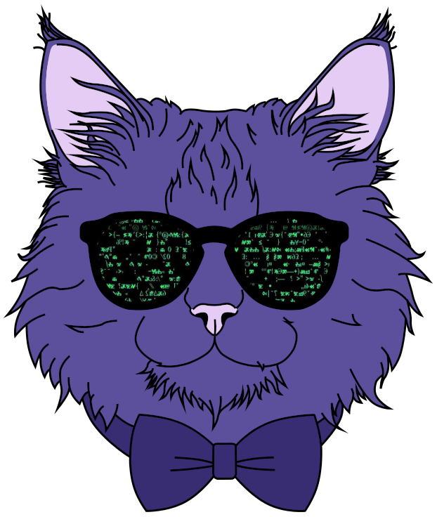

<!-- SECTION: Introduction and Logo -->

<h1 align="center">I'm Cat, and welcome to my GitHub!</h1>

  

<!-- SECTION: Personal Information -->

<h1 align="center">Victoria "Cat" Catlett</h1>

<h3 align="center">(they/them/theirs)</h3>

<h3 align="center">Software Engineer at the NRAO Green Bank Observatory</h3>

<h3 align="center">BSc Physics | BSc Mathematics</h3>

  

<!-- SECTION: Contact Me -->

<h3 align="center">Contact Me:</h3>

<!-- Contact Information Table -->
<table class="center">
  <!-- Table Header -->
  <thead>
    <tr>
      <th>Type</th>
      <th>Value</th>
    </tr>
  </thead>
  <!-- Table Body -->
  <tbody>
    <!-- Email -->
    <tr>
      <td style="text-align: center">
        
      </td>
      <td>victoria.w.catlett@gmail.com</td>
    </tr>
    <!-- LinkedIn -->
    <tr>
      <td style="text-align: center">
        
      </td>
      <td>victoria-catlett</td>
    </tr>
    <!-- Instagram -->
    <tr>
      <td style="text-align: center">
        
      </td>
      <td>@astro_catlett</td>
    </tr>
  </tbody>
</table>

